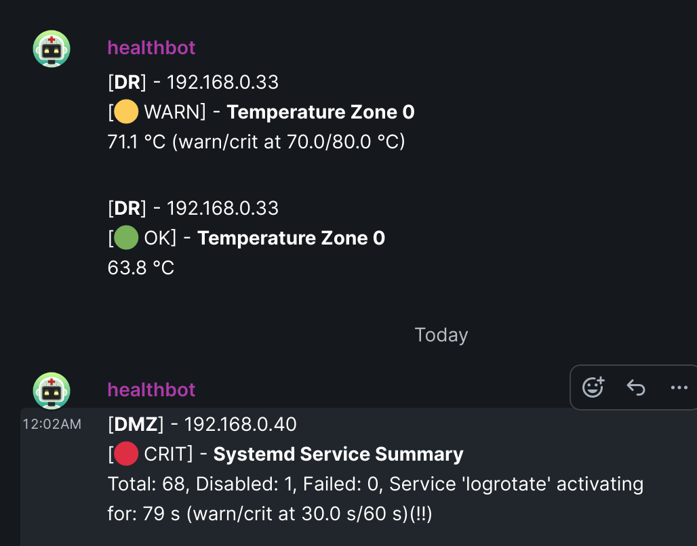
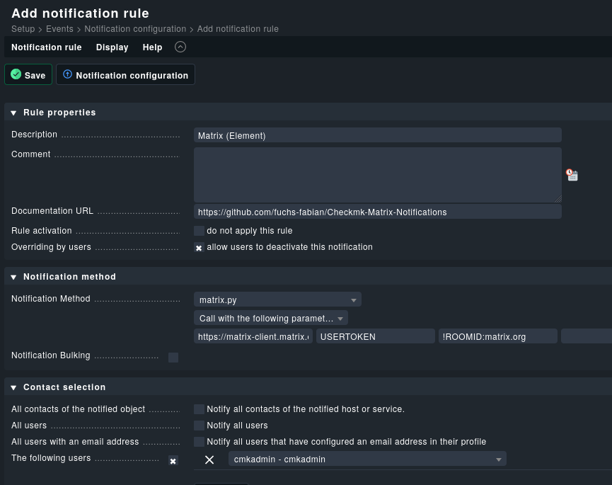

# Checkmk Matrix notifications

This script enables the integration of [Matrix](https://matrix.org) notifications in [Checkmk](https://checkmk.com/).

## Example

Notifications are usually sent via a Matrix group. Here is an example of how a Matrix notification is structured.

<div align="center">
    
</div>

## Requirements

In order for Checkmk to send notifications to the Matrix Messenger, we need:

- a Home Server URL, e.g., for a standard Matrix user `https://matrix-client.matrix.org`

  > It's available in account settings.

- a Matrix (Bot) User and its user token

  > Create a special user! Don't use your main account!  
  > It's available in account settings.  
  > To get it in [Element](https://element.io/), log in as the created (Bot) User, tap on the profile picture on the top left, and go to `all settings → Help and Info`.
  > There should be a dropdown menu on the bottom (Access token).

- a Room ID

  > You have to join with this special (Bot) account to this room before.  
  > It's available in room settings.

There are many good instructions for this on the Internet, so this is not part of this documentation.

## Installation

On the Checkmk server:

```bash
apt install python3-pip
```

Change to your Checkmk site user, eg. `monitoring`:

```bash
su - SITENAME
```

Example:

```bash
su - monitoring
```

Install the `requests` package:

```bash
pip install requests
```

Change to the notification directory:

```bash
cd ~/local/share/check_mk/notifications/
```

Download the script from Git repository:

```bash
wget https://raw.githubusercontent.com/fuchs-fabian/Checkmk-Matrix-Notifications/master/matrix.py
```

OR: Copy [`matrix.py`](https://github.com/fuchs-fabian/Checkmk-Matrix-Notifications/blob/master/matrix.py) file contents into the clipboard, create, paste and save the file:

```bash
nano ./matrix.py
```

Give the script execution permissions:

```bash
chmod +x ./matrix.py
```

### Activate changes

1. Activate on selected sites
2. Restart host or
   ```bash
   su - SITENAME
   ```
   ```bash
   omd stop
   ```
   ```bash
   omd start
   ```

### Dependencies

This script has no dependencies except Python 3 and the `requests` package.

> It was written specifically to be very compact and understandable.

## Configuration

Create your own notification rule in Checkmk.

`Setup → Events → Notifications`



| parameter | description                          |
| --------- | ------------------------------------ |
| 1         | Home Server URL (with http or https) |
| 2         | Bot User's Access Token              |
| 3         | Room ID                              |

## Troubleshooting

- [Checkmk Docs](https://docs.checkmk.com/latest/en/notifications.html#H1:Real)
- Checkmk notification logfile
  ```bash
  nano/omd/sites/SITENAME/var/log/notify.log
  ```

Possible HTTP error codes:

| error code         | possible problem        |
| ------------------ | ----------------------- |
| 401 (Unauthorized) | Invalid (user) token    |
| 403 (Forbidden)    | Invalid Home Server URL |

## Contributions

- Inspiration and partly quoted for the `README` - [Hagbear](https://github.com/Hagbear/checkmk-matrix-notify) - [LICENSE](https://github.com/Hagbear/checkmk-matrix-notify/blob/main/LICENSE)
- Initial repository - [Stanislav N. aka pztrn](https://gitlab.com/pztrn/check_mk_matrix_notifications)
- First fork (Replaced `urllib.request` by `requests`) - [bashclub / Thorsten Spille aka thorstenspille](https://github.com/bashclub/check_mk_matrix_notifications)
- Second fork (Prettify output) - [rwjack](https://github.com/rwjack/check_mk_matrix_notifications)
